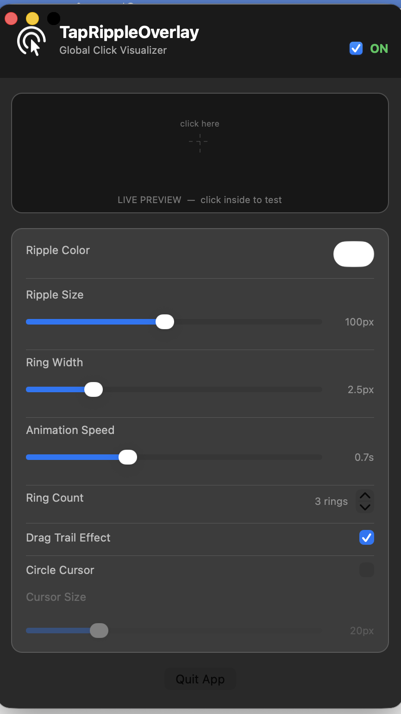

# TapRippleOverlay

A lightweight macOS utility that visualizes mouse clicks and drags as animated ripple effects — perfect for screen recordings, presentations, and tutorials.

When you click anywhere on screen, an expanding ring animation appears at the cursor position. Optional drag trails and a custom circle cursor replacement make every interaction clearly visible to your audience.

---

## Features

- **Click ripples** — animated expanding rings appear on every left mouse click, anywhere on screen
- **Drag trails** — subtle ripple bursts follow your cursor during drag operations
- **Circle cursor** — replace the system cursor with a custom colored circle for maximum visibility
- **Multi-display** — works across all connected monitors simultaneously
- **Live preview** — see your settings reflected instantly in the preferences window before going on screen
- **Menu bar access** — toggle the overlay on/off from the menu bar without opening the full settings window
- **Fully customizable** — ripple color, size, ring count, ring width, animation speed, and cursor size

---

## Screenshots



---

## Requirements

| Requirement | Version |
|---|---|
| macOS | 13 Ventura or later |
| Xcode | 15 or later |
| Swift | 5.9+ |

> **Accessibility permission required.** The app uses `NSEvent` global monitors to detect clicks outside its own windows, which requires Accessibility access (System Settings → Privacy & Security → Accessibility).

---

## Installation

### Build from source

1. **Clone the repository**

   ```bash
   git clone https://github.com/thetarunshekhawat/TapRippleOverlay.git
   cd TapRippleOverlay
   ```

2. **Open in Xcode**

   ```bash
   open TapRippleOverlay.xcodeproj
   ```

3. **Select your team** (for signing)
   - In Xcode, select the `TapRippleOverlay` target
   - Go to **Signing & Capabilities**
   - Set your **Team** to your Apple Developer account (a free account works for local builds)

4. **Build and run**
   - Press `Cmd+R` or click the **Run** button
   - macOS will prompt you to grant **Accessibility** permission — this is required for global click detection

5. **Grant Accessibility permission**
   - Open **System Settings → Privacy & Security → Accessibility**
   - Enable **TapRippleOverlay**
   - Restart the app if it was already running

---

## Usage

When launched, the **Settings** window opens automatically.

| Control | Description |
|---|---|
| **ON / OFF toggle** | Enable or disable the overlay globally |
| **Ripple Color** | Color swatch — pick any color for the rings and circle cursor |
| **Ripple Size** | Max radius the rings expand to (30 – 180 px) |
| **Ring Width** | Stroke thickness of each ring (0.5 – 10 px) |
| **Animation Speed** | How long each ripple lasts (0.3 – 1.5 s) |
| **Ring Count** | Number of concentric rings per click (1 – 6) |
| **Drag Trail Effect** | Toggle ripple bursts during mouse drag operations |
| **Circle Cursor** | Replace the system cursor with a colored dot |
| **Cursor Size** | Diameter of the circle cursor (8 – 60 px) |

The **Live Preview** area in the settings window lets you click inside it to see exactly how your current settings look before going on camera.

The **menu bar icon** (cursor with click indicator) gives quick access to:
- Open Settings
- Enable / Disable overlay
- Quit

---

## Project Structure

```
TapRippleOverlay/
├── AppDelegate.swift              # App entry point, wires all components together
├── RippleConfig.swift             # Single source of truth for all settings
├── RippleView.swift               # CALayer-based ripple + circle cursor rendering
├── OverlayWindowController.swift  # Transparent fullscreen overlay windows (one per display)
├── EventMonitorManager.swift      # Global + local NSEvent monitors for clicks and mouse movement
├── StatusBarController.swift      # Menu bar item and menu
├── PreferencesWindowController.swift  # Settings UI with live preview
└── main.swift                     # NSApplicationMain entry
```

### How it works

1. `EventMonitorManager` registers both global (system-wide) and local (in-app) `NSEvent` monitors for `leftMouseDown`, `leftMouseDragged`, and `mouseMoved`.
2. On each event, the delegate (`OverlayWindowController`) converts the Quartz (top-left origin) coordinate to Cocoa (bottom-left origin) and resolves which screen the point belongs to.
3. `OverlayWindowController` maintains a transparent, borderless, click-through `NSWindow` at screen-saver level for each display. These windows hold a `RippleView`.
4. `RippleView` uses `CAShapeLayer` animations (path expansion + opacity fade) to render ripples, and a separate `CAShapeLayer` for the circle cursor that tracks `mouseMoved` events without animation.

---

## Permissions

The app uses these macOS privacy-sensitive APIs:

| API | Why |
|---|---|
| `NSEvent.addGlobalMonitorForEvents` | Detect clicks in other apps |
| `CGDisplayHideCursor` / `CGDisplayShowCursor` | Hide system cursor when circle cursor is active |

The app is **not sandboxed** (see `TapRippleOverlay.entitlements`) because the sandbox blocks global event monitors.

---

## License

MIT License — see [LICENSE](LICENSE) for details.
